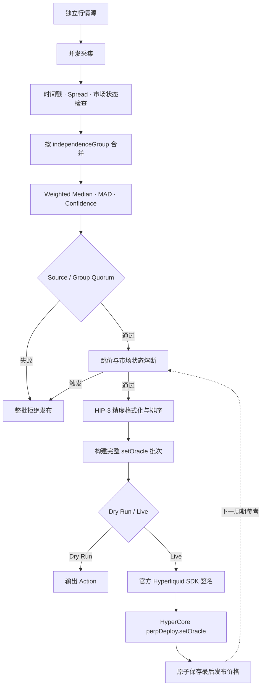

# HIP-3 Oracle

面向 Hyperliquid HIP-3 永续合约的多数据源预言机库。它把采集、异常过滤、聚合、风险控制与
`perpDeploy.setOracle` 发布拆开，并在任何 feed 不满足安全条件时拒绝整个批次。

> 当前版本是可运行的安全优先 MVP，不是“下载后直接上主网”的成品。主网前仍需接入有授权的独立市场
> 数据源、密钥托管、双机热备、监控告警和人工熔断恢复流程。

## 已实现

- Static 与通用 JSON/REST 数据源适配器
- 数据源独立性分组，不把同源 API 误当作独立报价
- 时间戳、future/stale、bid/ask spread 检查
- Weighted Median、MAD 异常值过滤、IQR confidence
- 最小 source quorum 与最小独立 group quorum
- 与上次已发布价格比较的跳价熔断
- Market Open/Closed/Unknown 策略
- HIP-3 价格精度与尾随零处理
- 全 feed 原子批次：缺少任何资产时不发送 `setOracle`
- 官方 `hyperliquid-python-sdk` 发布适配器
- Testnet/Mainnet 双重环境变量开关
- 原子持久化的上一笔价格状态
- dry-run CLI 与单元测试

## 数据流



Hyperliquid 官方要求 `setOracle` 的 tuple 列表按 key 排序，两次调用至少相隔 2.5 秒，并建议正常情况下约每
3 秒更新。本库默认 `intervalMs=3000`，同时在发布器中增加本地 2.5 秒限速。

- [HIP-3 deployer actions](https://hyperliquid.gitbook.io/hyperliquid-docs/for-developers/api/hip-3-deployer-actions)
- [HIP-3 overview and oracle responsibility](https://hyperliquid.gitbook.io/hyperliquid-docs/hyperliquid-improvement-proposals-hips/hip-3-builder-deployed-perpetuals)
- [Hyperliquid signing guidance](https://hyperliquid.gitbook.io/hyperliquid-docs/for-developers/api/signing)
- [Price precision rules](https://hyperliquid.gitbook.io/hyperliquid-docs/for-developers/api/tick-and-lot-size)

## 快速开始

要求 Python 3.11+。核心聚合与 dry-run 没有第三方运行时依赖。

```bash
python3 -m venv .venv
source .venv/bin/activate
python -m pip install -e .

hip3-oracle --config config/example.json validate
hip3-oracle --config config/example.json once
python -m unittest discover -s tests -v
```

示例配置使用四个静态报价，其中 `500.00` 会被 MAD 过滤。CLI 输出最终将发送的 HIP-3 action，但不会连接
Hyperliquid。

不安装包也可以运行：

```bash
PYTHONPATH=src python3 -m hip3_oracle --config config/example.json once
```

## 配置真实数据源

将 [config/json-source.example.json](config/json-source.example.json) 中的对象放进主配置的 `sources`，再把
source 名加入对应 feed。URL 支持 `{symbol}` 与 `{coin}` 占位符；字段路径支持 `data.price` 或 JSON Pointer
(`/data/price`)。

```json
{
  "kind": "json",
  "independenceGroup": "licensed-provider-a",
  "url": "https://provider.example/quotes/{symbol}",
  "headers": { "Authorization": "Bearer ${PROVIDER_A_TOKEN}" },
  "pricePath": "data.mid",
  "timestampPath": "data.timestamp",
  "timestampUnit": "ms"
}
```

关键配置：

| 字段 | 作用 |
| --- | --- |
| `minSources` | 过滤后至少保留的报价数 |
| `minIndependentGroups` | 过滤后至少保留的独立底层数据组数 |
| `maxSourceAgeMs` | 报价最大年龄 |
| `maxSpreadBps` | bid/ask 最大允许价差 |
| `outlierMadMultiplier` | MAD 异常值带宽倍数 |
| `maxConfidenceBps` | 聚合报价最大不确定性 |
| `maxJumpBps` | 相对上次已发布价格的最大跳变 |
| `blockWhenMarketClosed` | 休市时是否阻止更新 |
| `markPriceSets` | `0` 不提供额外 mark 输入；`1` 用本批聚合价提供一组输入 |

不要仅因为 API 域名不同就设置不同 `independenceGroup`。如果多个 API 最终都来自同一交易所或同一供应商，
它们必须属于同一个 group。

## Testnet 发布

真实发布只通过 Hyperliquid 官方 Python SDK 签名：

先复制配置并将其中 `dryRun` 改为 `false`。真实发布要求配置和命令行同时确认，避免误用示例配置。

```bash
python -m pip install -e '.[live]'
export HIP3_PRIVATE_KEY='0x...'
export HIP3_ENABLE_LIVE='YES'

hip3-oracle --config config/testnet.json once --live
hip3-oracle --config config/testnet.json run --live
```

配置中的 updater wallet 必须已被 HIP-3 deployer 授予 `setOracle` 权限。密钥只从进程环境读取，不允许写入
JSON 配置。建议使用专用、最小权限 oracle updater，并将 deployer key 保持离线。

主网还必须显式设置：

```bash
export HIP3_ENABLE_MAINNET='YES'
```

这只是防误操作开关，不替代审批、HSM/KMS 或发布权限隔离。

## Market closed 与 mark price

HIP-3 action 本身没有 `marketStatus` 字段。本库可以在内部识别市场状态，但具体策略必须按产品设计：

- `blockWhenMarketClosed=false`：持续重复发布最后可验证的收盘/盘后价格；
- `blockWhenMarketClosed=true`：拒绝发布，需要独立 deployer 运维流程调用 `haltTrading`；
- 对股票等 RWA，不应依赖“停止更新”作为休市保护，因为协议可能回退到本地 mark price。

默认 `markPriceSets=0`，避免把同一个聚合值伪装成多个独立 mark 输入。若有独立的 perp/index mark 数据管线，
应扩展 `build_payload`，分别提供最多两组真正独立的 mark 输入。

## 熔断恢复

`state/oracle-state.json` 保存最后一次成功（dry-run 也视为成功）发布的原始聚合价。新价格超过 `maxJumpBps`
时会持续 fail-closed。确认价格跳变真实后，应通过受审计的运维流程更新或迁移状态，而不是自动“等几次就接受”。

详见 [SECURITY.md](SECURITY.md)。
